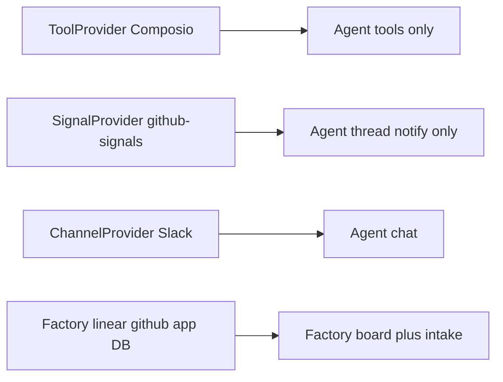
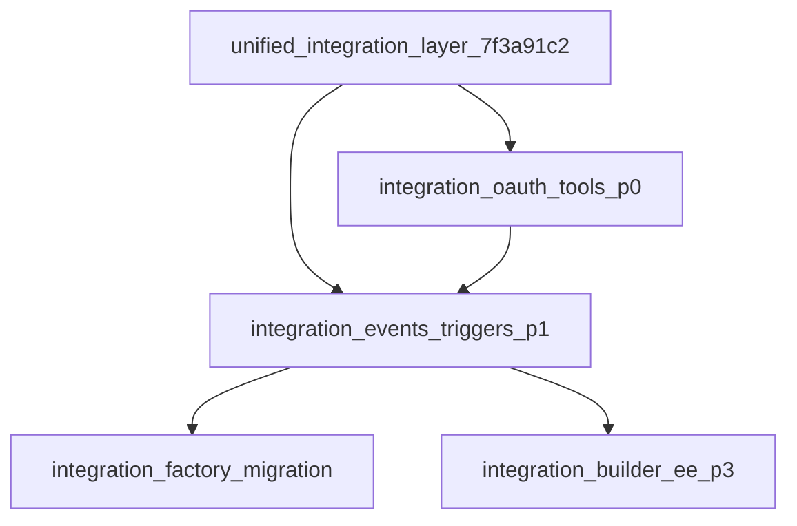

# Unified Integration Layer — Engineering plan

**Audience:** Engineering.  
**Team-facing proposal (problem, vision, architecture, business case, ask):** [`unified-integration-layer-proposal.md`](../../unified-integration-layer-proposal.md) — share that with Mastra; use this plan for implementation.

## TL;DR (eng)

P0: connection + OAuth building blocks + `resolveTools` → P1: `IntegrationEvent` + bindings + webhook ingress + `workflow.start` sink (demo must include tools + triggers) → P2/P4 factory migrate → P3 Builder EE. Vendor-neutral core; Composio/Nango as adapters.

---

## Current state (ground truth)

### Parallel stacks today



| Stack | What exists now | Limitation vs proposal |
|-------|-----------------|------------------------|
| **ToolProvider** | [`packages/core/src/tool-provider`](packages/core/src/tool-provider); Composio/Arcade in editor; connections store labels/scopes only (`per-author` \| `shared` \| `caller-supplied`) | No triggers; secrets in Composio; no `org` tenancy |
| **SignalProvider** | [`packages/core/src/signals/signal-provider.ts`](packages/core/src/signals/signal-provider.ts); `#subscriptions` **in-memory**; `notify` → agent | Agent-only; no workflow start; webhook route **not implemented** |
| **Agent signal HTTP** | `SEND_AGENT_SIGNAL_ROUTE` in server | Manual/API inject — not provider webhooks |
| **@mastra/github-signals** | [`signals/github`](signals/github) — poll + PR tools; subs in **thread metadata** | Only shipped SignalProvider package |
| **Channel Slack** | [`channels/slack`](channels/slack) — encrypted installs when key set | Chat UX, not automation triggers |
| **Factory Linear** | [`mastracode/web/src/web/linear`](mastracode/web/src/web/linear) — org `linear_connections`, **plaintext** tokens + scope/refresh | Not reusable by Studio/Builder/workflows |
| **Factory GitHub** | App installs + [`github_signal_subscriptions`](mastracode/web/src/web/github/subscriptions.ts) in app Postgres | Second GitHub sub store (alongside github-signals metadata) |
| **Factory board** | [`factory`](mastracode/web/src/web/factory) `work_items`; UI stages intake→triage→planning→execute→review→done | Manual/UI-driven; not event→workflow bindings |
| **Composio** | Tools/authorize only — no trigger APIs in [`composio.ts`](packages/editor/src/providers/composio.ts) | Cannot power Integration triggers without new adapter work |
| **Nango** | Not in repo | Candidate ExternalVault only |
| **Legacy Integration** | [`packages/core/src/integration/integration.ts`](packages/core/src/integration/integration.ts) | Unused — do not extend |

### Why this matters

GitHub PR → thread alone already has **three** mechanisms (in-memory SignalProvider maps, github-signals thread metadata, factory `github_signal_subscriptions`). Linear tools/auth live only in factory. That is the N×M tax the Integration layer removes.

---

## Proposed model

| Piece | Role |
|-------|------|
| **Integration** | Connect + tools + triggers (peer APIs) |
| **IntegrationEvent** | Normalized event from any trigger adapter — reusable across SignalProvider, factory webhooks, Composio/Nango |
| **IntegrationBinding** | Event → `signal` \| `workflow.start` \| `workflow.resume` |
| **Building blocks** | OAuth helper, NativeOAuthVault / ExternalVault / SecretStore, webhook/poll kits, tool helpers |

**Sources (equal citizens, glue in later):**

1. **External** — Nango / Composio adapters  
2. **Mastra-provided** — Slack, GitHub, future Jira, …  
3. **Customer-built** — private ERP/CRM  

```ts
new Mastra({
  integrations: {
    composio: new ComposioIntegration({ ... }),
    slack: new SlackIntegration({ ... }),
    'acme-erp': new AcmeErpIntegration({ ... }),
  },
})
```

**Reuse existing sinks:** `sendNotificationSignal`, `workflow.createRun` → `startAsync`. **Fix:** ship real webhook ingress (documented SignalProvider route is a gap today).

**Tenancy scope** (`per-author` | `shared` | `caller-supplied` | proposed `org`) ≠ **OAuth grant scopes** (`comments:create`, `read:jira-work`) — both first-class (credential pain today).

---

## Child plans

| Order | File | Builds on current… |
|-------|------|-------------------|
| 1 | [integration_oauth_tools_p0_b4e8c1d0.plan.md](integration_oauth_tools_p0_b4e8c1d0.plan.md) | ToolProvider + Linear OAuth patterns + Slack crypto |
| 2 | [integration_events_triggers_p1_9a2f6e31.plan.md](integration_events_triggers_p1_9a2f6e31.plan.md) | SignalProvider gap + missing webhook route + workflow start APIs |
| 3 | [integration_factory_migration_c8d14a57.plan.md](integration_factory_migration_c8d14a57.plan.md) | Factory linear/github/factory/intake as-is |
| 4 | [integration_builder_ee_p3_e1f90b62.plan.md](integration_builder_ee_p3_e1f90b62.plan.md) | Stored agents `toolProviders` only today |



## Non-goals

Replace Slack Channel chat · revive legacy `Integration` class · Composio SDK in `@mastra/core` · rewrite factory UI in P0/P1 · re-add `waitForEvent`
