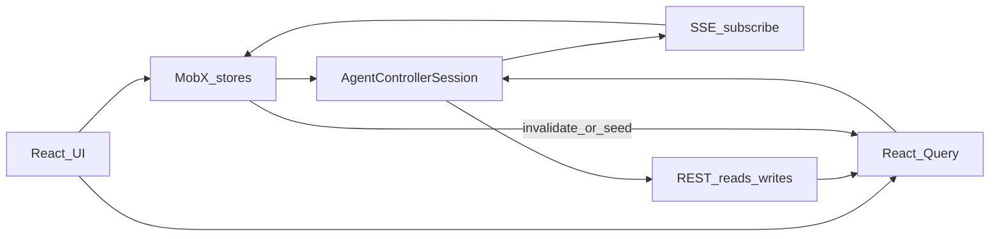
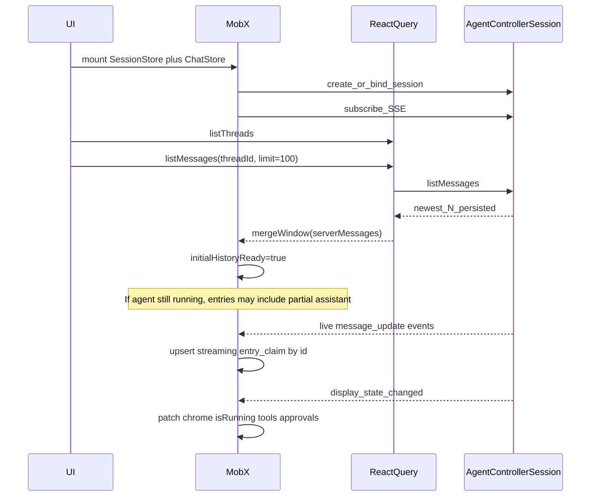
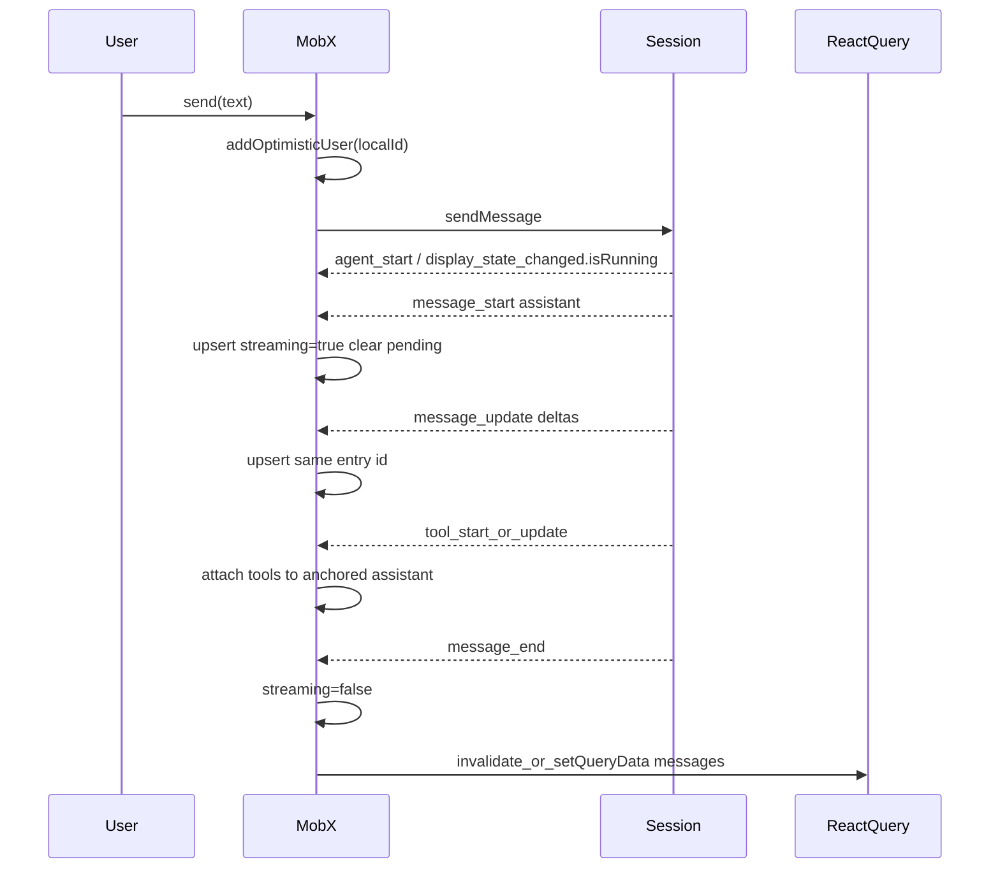

# Agent Controller UI State Plan (MobX + React Query)

Status: planning draft  
Audience: teams building a **custom** Agent Controller UI (inspired by Factory, not importing Factory UI)  
Stack: `@mastra/client-js` + MobX + React Query

## 1. Goal and non-goals

### Goal

Drive an Agent Controller session from your own React UI and store with:

- Consistent transcript on **cold load / page refresh**
- Live **streaming** updates without flicker or duplicates
- Safe **thread switches** and **load-older** history
- Clear extension points for product logic

### Non-goals

- Replacing Mastra Factory UI
- Using `@mastra/react` `useChat` (plain-agent stream API, not controller sessions)
- Publishing a new Mastra UI-state package in this pass
- Importing `@internal/factory-ui` (private; use as a pattern reference only)

## 2. What Mastra provides (reuse)

| Layer | Package / API | Reuse as |
| --- | --- | --- |
| Runtime | `@mastra/core/agent-controller` | Server session host |
| HTTP + SSE client | `@mastra/client-js` `AgentControllerSession` | Transport only |
| Typed events | `AgentControllerEvent`, `isKnownAgentControllerEvent` | Event narrowing |
| Reduced live chrome snapshot | `display_state_changed` / `AgentControllerDisplayState` | Running flag, current stream message, tools, approvals, OM, usage |
| Message types | `MastraDBMessage` | Transcript row payload |
| Pattern reference | Factory UI (internal) | Copy merge/connection patterns |

### Session methods you will call

From `@mastra/client-js` `AgentControllerSession`:

| Method | Role |
| --- | --- |
| `subscribe({ onEvent, onConnectionChange? })` | Live SSE events |
| `sendMessage(...)` | User turns / steers |
| `switchThread(threadId)` | Bind session to a thread |
| `createThread(title?)` | New thread |
| `listThreads(...)` | Sidebar list |
| `listMessages(threadId, limit?)` | Newest-N history window |
| abort / approve / resume APIs | HITL controls |

### Important server facts

1. **SSE does not replay history.** A new subscription only receives events after connect. Anything that happened before connect must come from `listMessages` (or a reconnect refetch).
2. **`display_state_changed` is a chrome/snapshot channel**, not a full transcript rebuild. It carries `isRunning`, `currentMessage`, tools, approvals, suspensions, OM, token usage, etc.
3. **Durable transcript truth for a cold page** is storage via `listMessages`. Live truth mid-session is your in-memory transcript store updated by `message_*` / tool events, periodically reconciled with `listMessages`.

## 3. What Mastra does not provide

- No public MobX / Zustand / Redux store for Agent Controller
- No public React hooks for controller transcript/thread UI
- No cursor-based message pagination API today — Factory grows a `limit` window (`100 → 200 → …`)

## 4. Ownership split



| Concern | Owner | Why |
| --- | --- | --- |
| Threads, modes, models, permissions, settings | React Query | Cacheable GETs, refetch, invalidation |
| Message history windows (`listMessages`) | React Query | Durable snapshot; remount/refresh friendly |
| SSE connection lifecycle | MobX `SessionStore` | Long-lived; not request/response |
| Active thread id, optimistic sends | MobX `ChatStore` | Ephemeral UI intent |
| Live transcript entries + stream flags | MobX `ChatStore` | High-churn event fold |
| Product/domain logic | MobX domain actions | Extend without forking the applicator |

**Hard rule:** React Query never owns the live stream. MobX never treats server lists as source of truth without a fetch.

## 5. Store and query map

### MobX `SessionStore`

- `controllerId`, `resourceId`, optional scope/tags
- Connection: `connecting | ready | reconnecting | error`
- Subscription handle + reconnect policy
- Last known server session metadata (`isRunning`, mode, model) mirrored from events / state sync

### MobX `ChatStore`

- `activeThreadId`
- `historyEpoch` / `threadGeneration` (monotonic; ignore stale async results)
- `initialHistoryReady: boolean`
- `entries: TranscriptEntry[]` (committed + streaming + optimistic)
- `displayState: AgentControllerDisplayState | null` (chrome)
- `pendingLocalIds: Set<string>` (optimistic user rows)
- Actions: `resetThread`, `mergeWindow`, `applyEvent`, `addOptimisticUser`, `failOptimisticUser`, `markHistoryReady`

### React Query keys (Factory-inspired)

```
['agent-controller', controllerId, 'sessions', resourceId, scope, 'threads']
['agent-controller', ..., 'threads', threadId, 'messages', limit]
['agent-controller', ..., 'modes' | 'settings' | 'permissions']
['agent-controller', ..., 'connection-state']  // optional mirrored running/tasks
```

Suggested defaults:

- `INITIAL_THREAD_MESSAGE_LIMIT = 100`
- `LOAD_MORE_STEP = 100`
- Messages query: `staleTime: 0`, `refetchOnMount: 'always'`, no focus refetch
- `placeholderData`: keep previous **only when the thread key prefix matches** (load-more must not flash empty; thread switch must not bleed)

## 6. Transcript model (MobX)

Treat the visible timeline as an ordered list of entries, not “whatever RQ last returned.”

Each entry roughly:

- `id` — stable UI identity (prefer local id once assigned; remap server ids onto it)
- `message: MastraDBMessage` — payload
- `streaming: boolean`
- `deliveryStatus?: 'pending' | 'delivered' | 'failed'` (optimistic user)
- Optional live tool overlay keyed by `toolCallId`

### Two channels into the timeline

| Channel | Updates | Does not update |
| --- | --- | --- |
| `listMessages` → `mergeWindow` | Seed / heal / prepend older history | Continuous token streaming |
| SSE `message_*` / tool_* / approval_* | Live upserts, streaming flags, tool cards | Full historical backfill |

`display_state_changed` updates **chrome** (`isRunning`, OM, usage, pending approval UI). Optionally mirror `currentMessage` into the streaming assistant entry, but Factory’s durable bubble list is driven by `message_*`, not by replacing the whole list from display state.

## 7. Consistency core: history ↔ streaming (detailed)

This is the hard part. The UI must look correct in five situations:

1. Cold load / page refresh (agent idle)
2. Cold load / refresh **while the agent is still running**
3. Live streaming without refresh
4. Thread switch
5. Load-older during or after a stream
6. SSE drop + reconnect

### 7.1 Invariant

For a given `activeThreadId`:

```text
visibleEntries = mergeWindow(
  serverWindowNewestN,          // from RQ listMessages
  liveEntries                    // from SSE since subscribe
)
```

Properties `mergeWindow` must guarantee:

1. **Idempotent** — applying the same server window twice is a no-op (referential stability when nothing changed).
2. **Identity-stable** — once a row is on screen, keep its entry `id` even if the server message id arrives later or rotates mid-run.
3. **Live tail wins while streaming** — if the on-screen assistant is streaming and server text is a **prefix** of live text, keep live text (persist lag).
4. **Server wins on heal after gaps** — if server message **strictly extends** a stalled on-screen assistant (SSE gap), adopt server parts.
5. **Optimistic users reconcile** — pending local user rows match server/signal rows by id or drawable text and become `delivered` without duplicating.
6. **Do not reorder** known anchors — insert missing older messages around anchors; never scramble the live tail.
7. **Empty server window is a no-op** — do not clear live entries because a fetch returned `[]` during a race.

### 7.2 Claim / match rules (order matters)

When merging a server message into on-screen entries, claim in this order (Factory-style):

1. Exact message `id`
2. Shared `toolCallId` on tool parts (assistant identity rotation mid-tool)
3. Drawable text prefix match **only while** the on-screen entry is `streaming: true`
4. Optimistic user / steer text claim (consume at most once per local entry)

If no claim: insert as a new entry at the correct chronological anchor.

### 7.3 Flags that prevent races

| Flag / token | Purpose |
| --- | --- |
| `threadGeneration` | Increment on every `activeThreadId` change; tag in-flight `listMessages` / `switchThread`; ignore results with older generation |
| `initialHistoryReady` | `false` until the first successful `mergeWindow` for the active thread; gate the transcript UI (skeleton / “preparing”) |
| `historyLimit` | Reset to `INITIAL` on thread change in the same render as the thread id change (do not wait for an effect) |
| Connection epoch | On SSE reconnect, refetch messages and `mergeWindow` (no event replay) |
| RQ `placeholderData` same-thread only | Load-more keeps pixels; thread switch clears foreign cache |

### 7.4 Who writes the streaming assistant bubble?

**Recommended split (matches Factory + controller display state):**

| UI surface | Source |
| --- | --- |
| Message list bubbles | MobX entries via `message_start` / `message_update` / `message_end` (+ tool events) |
| Stop button / busy / OM bar / approval modal | `displayState` from `display_state_changed` |
| Status “running” on refresh before first SSE event | Session state fetch or first `display_state_changed` / `agent_start` |

Do **not** rebuild the entire message list from `displayState.currentMessage` on every tick — that fights `listMessages` and loses older rows.

### 7.5 Page refresh algorithm (cold start)



Step list:

1. Know `controllerId`, `resourceId`, and target `threadId` (route / store).
2. Start session bind + SSE subscribe **in parallel** with messages fetch (do not wait for history before subscribing — you will miss live tokens otherwise).
3. While `listMessages` is undefined: show preparing state (`initialHistoryReady === false`). Keep entries empty or show a skeleton — **do not** render a false empty conversation.
4. When messages resolve: `mergeWindow(messages)` then `initialHistoryReady = true`.
5. Live events that arrived **before** history resolved must still apply: buffer events for the active `threadGeneration` or apply them into an empty store and let `mergeWindow` claim them afterward (claim rules make this safe).
6. If session reports `isRunning` (state sync or display state): show Stop / busy even before the next token.
7. Continue upserting `message_*` onto claimed entries.

**Refresh while running — specific expectations:**

- Persisted window may contain a partial assistant message.
- SSE will **not** replay earlier tokens; it continues from “now.”
- Live `message_update` must claim that partial row by id (or streaming prefix) and extend it.
- If the first live update has a **new** message id (run stepped), create a new streaming entry; do not duplicate if toolCallId links them.

### 7.6 Live streaming mid-session (no refresh)



Rules:

1. Optimistic user row first (`deliveryStatus: 'pending'`).
2. Ignore echo of plain user SSE if it would duplicate the optimistic row; reconcile by claim instead.
3. Assistant `message_start` / `message_update`: `streaming: true`; keep entry id stable across updates.
4. Do **not** write every token into React Query — RQ stays a durable window, updated on settle / reconnect / load-more.
5. On `message_end` / agent idle: optionally `setQueryData` to include the completed messages so a remount does not flash older cache.

### 7.7 Thread switch

1. Increment `threadGeneration`.
2. Set `activeThreadId` immediately.
3. `resetThread()` MobX entries; `initialHistoryReady = false`; reset `historyLimit` to `INITIAL`.
4. `await session.switchThread(id)` (ignore if generation mismatch on completion).
5. RQ fetch `listMessages(id, INITIAL)` — ignore result if generation mismatch.
6. `mergeWindow` + `initialHistoryReady = true`.
7. Prefer remounting the transcript view keyed by `` `${resourceId}:${threadId}` `` so no previous-thread listeners linger.

Stale-response guard (required):

```text
const gen = ++threadGeneration
const messages = await listMessages(...)
if (gen !== threadGeneration) return  // abandoned switch
mergeWindow(messages)
```

### 7.8 Load older messages

1. User scrolls to top → `historyLimit += LOAD_MORE_STEP`.
2. RQ key changes → fetch larger newest-N window (API has limit, not cursor).
3. Keep `placeholderData` from previous same-thread data (no blank flash).
4. Preserve scroll position on prepend.
5. `mergeWindow(largerWindow)`:
   - Prepend missing older messages
   - Re-claim overlapping anchors
   - **Preserve live streaming tail** and tool overlays
   - Never replace a longer streaming text with a shorter persisted prefix

### 7.9 SSE disconnect / reconnect

SSE has **no replay**. On `dropped → connected`:

1. Mark MobX connection `reconnecting` → `ready`.
2. Invalidate (or actively refetch) the active thread messages query **and** session state.
3. When refetch completes: `mergeWindow` to heal gaps (adopt covering server copies, reconcile terminal tool results).
4. Do not clear the transcript while reconnecting — that causes flicker.
5. If the agent was running, `display_state_changed` / state sync restores busy chrome.

### 7.10 Single applicator (avoid dual writers)

Implement one MobX action `applyControllerEvent(event)`:

| Event | ChatStore effect |
| --- | --- |
| `message_start` / `message_update` | Upsert assistant/signal entry, `streaming: true` |
| `message_end` | Upsert, `streaming: false`; reconcile optimistic users if needed |
| Tool start/delta/end | Overlay on anchored assistant entry |
| Approval / suspension | Prompt entries or `displayState` pending fields |
| `display_state_changed` | Replace chrome snapshot; optionally ensure streaming entry mirrors `currentMessage` if you choose that path |
| `thread_changed` / `thread_created` | Sanity sync; invalidate threads query |
| `agent_start` / `agent_end` | Busy latch fallback if display state lags |

Domain logic observes ChatStore / SessionStore — it must not open a second SSE consumer that also mutates entries.

## 8. React Query ↔ MobX bridge

| Moment | Direction | Action |
| --- | --- | --- |
| Messages query success | RQ → MobX | `mergeWindow(data)` |
| Load-more success | RQ → MobX | `mergeWindow(data)` |
| Thread switch | MobX → RQ | New key; reset limit |
| Message settled / reconnect | MobX → RQ | `invalidateQueries` or `setQueryData` |
| Threads list mutation | MobX → RQ | Invalidate threads |
| Live tokens | SSE → MobX only | Do not stream into RQ |

## 9. Extension points for your logic

Wrap writes:

- `send`, `steer`, `switchThread`, `createThread`, `approveTool`, `abort`, `loadOlder`

Put product side effects **after** session calls or inside observers of ChatStore fields (`isRunning`, approvals, tasks). Do not fork `mergeWindow` for analytics.

## 10. Factory reference map (inspiration only)

Internal paths to read when implementing (do not import the package):

- Connection: `mastracode/factory-ui/src/ui/domains/chat/hooks/useAgentControllerConnection.ts`
- Transcript reducer / `mergeWindow`: `mastracode/factory-ui/src/ui/domains/chat/services/transcript.ts`
- Transcript hook + `initialHistoryReady`: `.../hooks/useAgentControllerTranscript.ts`
- RQ window: `mastracode/factory-ui/src/hooks/useAgentControllerThreadMessages.ts`
- Provider wiring: `.../context/ChatTranscriptProvider.tsx`
- Session sync / reconnect poll: `.../hooks/useAgentControllerSessionSync.ts`
- Docs: Agent Controller “Connect a UI” (`display_state_changed`, `session.displayState.get()`)

## 11. Build order

1. `SessionStore` + subscribe / reconnect
2. RQ threads + `switchThread` + windowed `listMessages` → `mergeWindow` + `initialHistoryReady`
3. `message_*` applicator for live streaming upserts
4. `display_state_changed` → chrome
5. Optimistic send / abort / approvals
6. Reconnect refetch + `mergeWindow` heal
7. Load-older merge + scroll preserve
8. Domain actions on the same spine

## 12. Testing matrix (minimum)

Unit-test `mergeWindow` / `applyEvent` with fixtures:

1. Cold hydrate then identical re-merge (referential no-op)
2. Optimistic user then server echo → single delivered row
3. Streaming assistant + shorter server prefix → keep live text
4. Streaming assistant + longer server copy after gap → adopt server
5. Thread generation mismatch → discard stale fetch
6. Load-more prepend preserves streaming tail
7. Tool terminal on server heals stuck `call` part; never regresses terminal → call
8. Empty server window does not wipe live entries

Integration (MSW):

- Refresh while `isRunning: true` + mid-thread messages → busy chrome + continued `message_update`
- Reconnect invalidates messages and heals without clearing UI

## 13. Risks

- Controller event shapes are still evolving (beta) — keep the applicator thin and tested.
- `AgentControllerDisplayState` uses `Map`s — clone/serialize carefully if you mirror across boundaries.
- Growing `limit` refetch gets more expensive on very long threads; virtualize the list when you exceed one window.
- Missing `threadGeneration` will cause the most visible consistency bugs (wrong thread’s history landing after a fast switch).

## 14. Summary

Use **React Query for durable newest-N history**, **MobX for live transcript + connection**, and a disciplined **`mergeWindow`** so refresh, streaming, reconnect, and load-older all converge on one timeline. Prefer **`message_*` for bubbles** and **`display_state_changed` for chrome**. Assume **SSE never replays** — every reconnect must refetch and merge.
