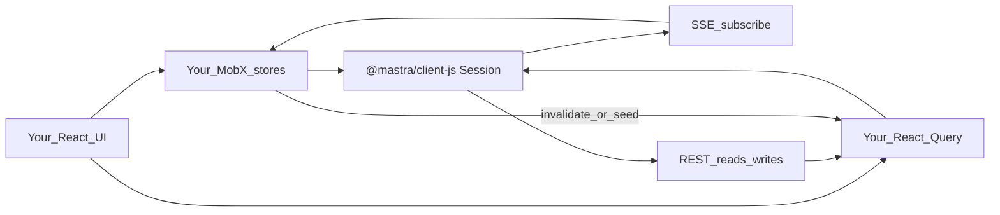
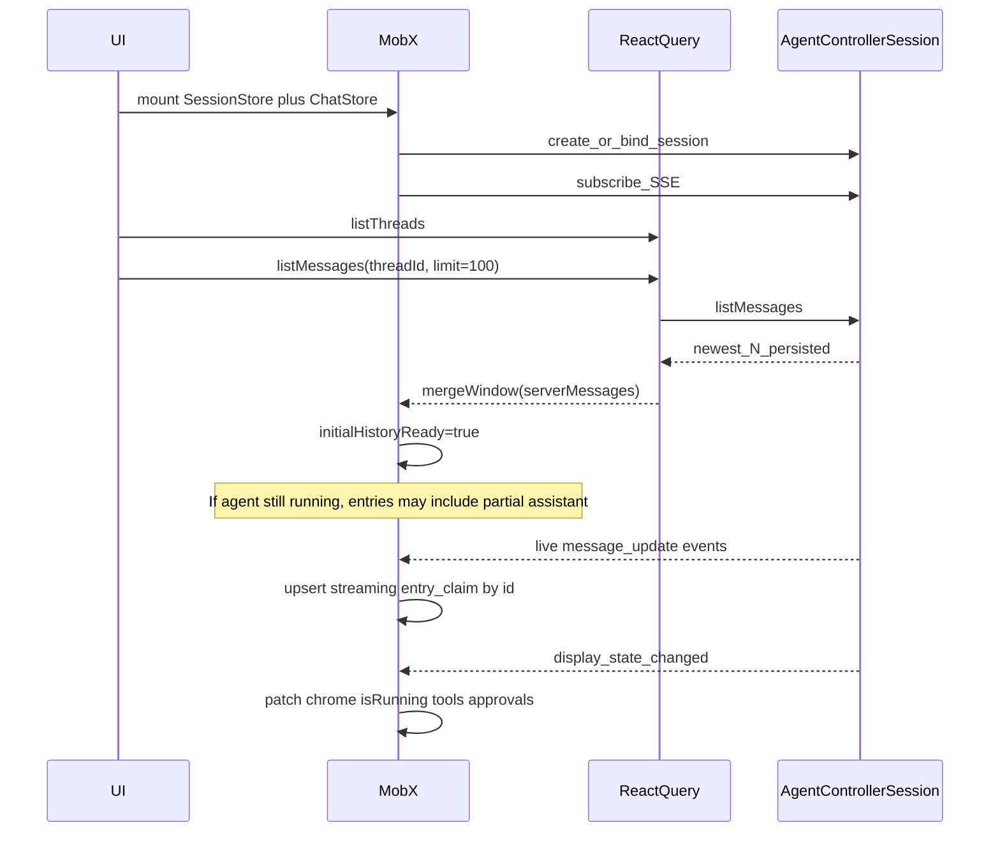
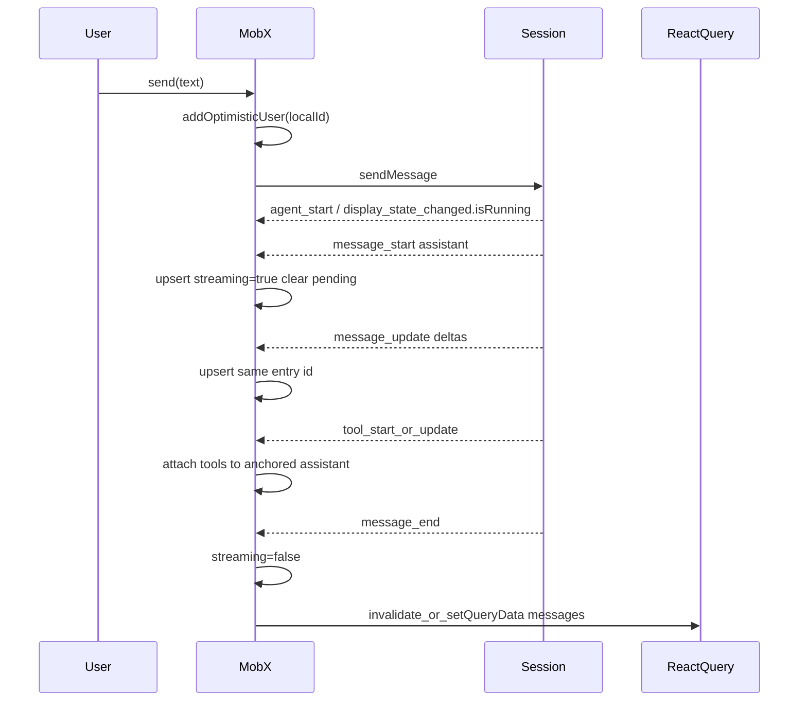

# Agent Controller UI State Plan (MobX + React Query)

Status: planning draft — **portable** (copy into any app)  
Audience: a **standalone React app** that talks to a Mastra server’s Agent Controller  
Stack in the app: `@mastra/client-js` + MobX + React Query  
Does **not** depend on Factory, Studio, or any Mastra UI package

## 0. How to use this plan in another app

1. Copy this document into your app repo (or keep it as an implementation checklist).
2. Install only: `@mastra/client-js` (and optionally type imports from `@mastra/core` if you need shared message/event types).
3. Point `MastraClient` at your Mastra server base URL (the server that registered the Agent Controller).
4. Implement stores/hooks in **your** app. Nothing here is published as a Mastra package.
5. Treat public client methods + SSE events + `display_state_changed` as the contract. Ignore any Mastra-internal UI code.

```ts
import { MastraClient } from '@mastra/client-js'

const client = new MastraClient({ baseUrl: process.env.MASTRA_API_URL! })
const controller = client.getAgentController('your-controller-id')
const session = controller.session(resourceId /* e.g. userId */, scope? /* optional */)
await session.create({ threadId? })
await session.subscribe({ onEvent, onReconnect? })
```

Your app owns: routing, auth headers, MobX stores, React Query cache, and all UI components.

## 1. Goal and non-goals

### Goal

In **your** app, drive an Agent Controller session so **every Agent Controller client capability is ready to use in the UI**, including:

- Consistent transcript on **cold load / page refresh**
- Live **streaming** without flicker or duplicates
- Safe **thread switches** and **load-older** history
- Running work visibility (tasks, tools, subagents, active runs)
- HITL (approvals, suspensions), modes/models, permissions, OM, goals, workspace, notifications
- Clear extension points for **your** product logic

“Feature ready” means: for each public `@mastra/client-js` Agent Controller method and each known event / display-state field, the UI has a MobX or React Query owner, a cold-load path, a live path, and a visible control or status surface (even if some surfaces start minimal).

### Non-goals

- Depending on Factory, Studio, playground, or any Mastra-internal UI
- Using `@mastra/react` `useChat` (plain-agent stream API, not controller sessions)
- Waiting for Mastra to publish an official MobX/RQ Agent Controller UI kit
- Building non-controller product features (boards, CRM, etc.) inside this plan — only the Agent Controller session/chat surface

## 2. What Mastra provides (reuse from npm)

| Layer | Package / API | Reuse as |
| --- | --- | --- |
| HTTP + SSE client | `@mastra/client-js` `MastraClient` / `AgentController` / `AgentControllerSession` | **Only** transport your app needs |
| Typed events | `AgentControllerEvent`, `isKnownAgentControllerEvent` | Event narrowing in your applicator |
| Reduced live chrome snapshot | `display_state_changed` / `AgentControllerDisplayState` | Running flag, tools, approvals, OM, usage |
| Message types | `MastraDBMessage` (from client/core types) | Transcript row payload |
| Server runtime | Your Mastra deployment with an Agent Controller registered | Backend you already host |

You do **not** need Factory (or any other Mastra frontend) to implement this.

### Client surface to cover (complete)

**Controller** (`client.getAgentController(id)`):

| Method | Role |
| --- | --- |
| `listModes` | Mode catalog |
| `listModels` | Model catalog (`hasApiKey`, use counts) |
| `listActiveRuns` | Cross-resource busy map |
| `workspaceStatus` | Sandbox / workspace readiness |
| `session(resourceId, scope?)` | Session handle |

Also: `client.listAgentControllers()` when hosting more than one controller.

**Session** (`controller.session(...)`) — every public method must have a store action + UI affordance:

| Area | Methods |
| --- | --- |
| Lifecycle | `create`, `subscribe` (+ reconnect/`onReconnect`), `state`, `setState`, `setResourceId`, `getResourceIds` |
| Messaging | `sendMessage` (text or `{ content, files? }`), `steer`, `followUp`, `abort` |
| HITL | `approveTool`, `respondToToolSuspension` |
| Mode / model | `switchMode`, `switchModel({ scope?, modeId? })` |
| Threads | `listThreads`, `switchThread`, `createThread`, `renameThread`, `deleteThread`, `cloneThread`, `listMessages` |
| OM / goals | `getOMRecord`, `getGoal`, `setGoal`, `updateGoal`, `clearGoal` |
| Permissions | `getPermissions`, `setPermissionForCategory`, `setPermissionForTool` |
| Signals | `sendNotification` |

Full feature ownership, cold vs live paths, and UI surfaces are in **§11**.

### Important server facts

1. **SSE does not replay history.** A new subscription only receives events after connect. Anything that happened before connect must come from `listMessages` (or a reconnect refetch).
2. **`display_state_changed` is a chrome/snapshot channel**, not a full transcript rebuild. It carries `isRunning`, `currentMessage`, tools, approvals, suspensions, OM, token usage, etc.
3. **Durable transcript truth for a cold page** is storage via `listMessages`. Live truth mid-session is your in-memory transcript store updated by `message_*` / tool events, periodically reconciled with `listMessages`.

## 3. What Mastra does not provide (you build in your app)

- No public MobX / Zustand / Redux store for Agent Controller
- No public React hooks for controller transcript/thread UI
- No cursor-based message pagination API today — grow a `limit` window (`100 → 200 → …`) via `listMessages(threadId, limit)`
- No React components for composer, transcript, HITL cards, task panel, etc. — all yours

## 4. Ownership split (inside your app)



| Concern | Owner in your app | Why |
| --- | --- | --- |
| Threads, modes, models, permissions, settings | React Query | Cacheable GETs, refetch, invalidation |
| Message history windows (`listMessages`) | React Query | Durable snapshot; remount/refresh friendly |
| SSE connection lifecycle | MobX `SessionStore` | Long-lived; not request/response |
| Active thread id, optimistic sends | MobX `ChatStore` | Ephemeral UI intent |
| Live transcript entries + stream flags | MobX `ChatStore` | High-churn event fold |
| Your product logic | MobX domain actions | Extend without forking the applicator |

**Hard rule:** React Query never owns the live stream. MobX never treats server lists as source of truth without a fetch.

## 5. Store and query map

### MobX stores

| Store | Owns |
| --- | --- |
| `SessionStore` | `controllerId`, `resourceId`, scope/tags, connection status, subscription, reconnect, `create`/`state`/`setState` |
| `ChatStore` | `activeThreadId`, `threadGeneration`, `initialHistoryReady`, transcript `entries`, optimistic locals, full `displayState`, HITL cards, follow-up queue; actions `mergeWindow` / `applyEvent` / send helpers |
| `GoalStore` | goal record + `goal_evaluation` |
| `OMStore` | OM chrome from display state + optional `getOMRecord` detail |
| `WorkspaceStore` | workspace readiness / errors |
| Domain stores | product-only observers/actions |

### React Query keys (suggested)

```
['agent-controller', controllerId]
['agent-controller', controllerId, 'modes' | 'models' | 'workspace' | 'active-runs']
['agent-controller', controllerId, 'sessions', resourceId, scope, 'state']
['agent-controller', ..., 'threads']
['agent-controller', ..., 'threads', threadId, 'messages', limit]
['agent-controller', ..., 'permissions' | 'goal' | 'om-record' | 'settings']
```

Suggested defaults:

- `INITIAL_THREAD_MESSAGE_LIMIT = 100`
- `LOAD_MORE_STEP = 100`
- Messages query: `staleTime: 0`, `refetchOnMount: 'always'`, no focus refetch
- `placeholderData`: keep previous **only when the thread key prefix matches**

## 6. Transcript model (MobX)

Treat the visible timeline as an ordered list of entries, not “whatever RQ last returned.”

Each entry roughly:

- `id` — stable UI identity (prefer local id once assigned; remap server ids onto it)
- `message: MastraDBMessage` — payload
- `streaming: boolean`
- `deliveryStatus?: 'pending' | 'delivered' | 'failed'` (optimistic user)
- Optional live tool overlay keyed by `toolCallId`

### Two channels into the timeline

| Channel | Updates | Does not update |
| --- | --- | --- |
| `listMessages` → `mergeWindow` | Seed / heal / prepend older history | Continuous token streaming |
| SSE `message_*` / tool_* / approval_* | Live upserts, streaming flags, tool cards | Full historical backfill |

`display_state_changed` updates **chrome** (`isRunning`, OM, usage, pending approval UI). Optionally mirror `currentMessage` into the streaming assistant entry. Keep the durable bubble list driven by `message_*` + `listMessages`/`mergeWindow` — do not rebuild the whole transcript from display state.

## 7. Consistency core: history ↔ streaming (detailed)

This is the hard part. The UI must look correct in five situations:

1. Cold load / page refresh (agent idle)
2. Cold load / refresh **while the agent is still running**
3. Live streaming without refresh
4. Thread switch
5. Load-older during or after a stream
6. SSE drop + reconnect

### 7.1 Invariant

For a given `activeThreadId`:

```text
visibleEntries = mergeWindow(
  serverWindowNewestN,          // from RQ listMessages
  liveEntries                    // from SSE since subscribe
)
```

Properties `mergeWindow` must guarantee:

1. **Idempotent** — applying the same server window twice is a no-op (referential stability when nothing changed).
2. **Identity-stable** — once a row is on screen, keep its entry `id` even if the server message id arrives later or rotates mid-run.
3. **Live tail wins while streaming** — if the on-screen assistant is streaming and server text is a **prefix** of live text, keep live text (persist lag).
4. **Server wins on heal after gaps** — if server message **strictly extends** a stalled on-screen assistant (SSE gap), adopt server parts.
5. **Optimistic users reconcile** — pending local user rows match server/signal rows by id or drawable text and become `delivered` without duplicating.
6. **Do not reorder** known anchors — insert missing older messages around anchors; never scramble the live tail.
7. **Empty server window is a no-op** — do not clear live entries because a fetch returned `[]` during a race.

### 7.2 Claim / match rules (order matters)

When merging a server message into on-screen entries, claim in this order:

1. Exact message `id`
2. Shared `toolCallId` on tool parts (assistant identity rotation mid-tool)
3. Drawable text prefix match **only while** the on-screen entry is `streaming: true`
4. Optimistic user / steer text claim (consume at most once per local entry)

If no claim: insert as a new entry at the correct chronological anchor.

### 7.3 Flags that prevent races

| Flag / token | Purpose |
| --- | --- |
| `threadGeneration` | Increment on every `activeThreadId` change; tag in-flight `listMessages` / `switchThread`; ignore results with older generation |
| `initialHistoryReady` | `false` until the first successful `mergeWindow` for the active thread; gate the transcript UI (skeleton / “preparing”) |
| `historyLimit` | Reset to `INITIAL` on thread change in the same render as the thread id change (do not wait for an effect) |
| Connection epoch | On SSE reconnect, refetch messages and `mergeWindow` (no event replay) |
| RQ `placeholderData` same-thread only | Load-more keeps pixels; thread switch clears foreign cache |

### 7.4 Who writes the streaming assistant bubble?

**Recommended split:**

| UI surface | Source |
| --- | --- |
| Message list bubbles | MobX entries via `message_start` / `message_update` / `message_end` (+ tool events) |
| Stop button / busy / OM bar / approval modal | `displayState` from `display_state_changed` |
| Status “running” on refresh before first SSE event | Session state fetch or first `display_state_changed` / `agent_start` |

Do **not** rebuild the entire message list from `displayState.currentMessage` on every tick — that fights `listMessages` and loses older rows.

### 7.5 Page refresh algorithm (cold start)



Step list:

1. Know `controllerId`, `resourceId`, and target `threadId` (route / store).
2. Start session bind + SSE subscribe **in parallel** with messages fetch (do not wait for history before subscribing — you will miss live tokens otherwise).
3. While `listMessages` is undefined: show preparing state (`initialHistoryReady === false`). Keep entries empty or show a skeleton — **do not** render a false empty conversation.
4. When messages resolve: `mergeWindow(messages)` then `initialHistoryReady = true`.
5. Live events that arrived **before** history resolved must still apply: buffer events for the active `threadGeneration` or apply them into an empty store and let `mergeWindow` claim them afterward (claim rules make this safe).
6. If session reports `isRunning` (state sync or display state): show Stop / busy even before the next token.
7. Continue upserting `message_*` onto claimed entries.

**Refresh while running — specific expectations:**

- Persisted window may contain a partial assistant message.
- SSE will **not** replay earlier tokens; it continues from “now.”
- Live `message_update` must claim that partial row by id (or streaming prefix) and extend it.
- If the first live update has a **new** message id (run stepped), create a new streaming entry; do not duplicate if toolCallId links them.

### 7.6 Live streaming mid-session (no refresh)



Rules:

1. Optimistic user row first (`deliveryStatus: 'pending'`).
2. Ignore echo of plain user SSE if it would duplicate the optimistic row; reconcile by claim instead.
3. Assistant `message_start` / `message_update`: `streaming: true`; keep entry id stable across updates.
4. Do **not** write every token into React Query — RQ stays a durable window, updated on settle / reconnect / load-more.
5. On `message_end` / agent idle: optionally `setQueryData` to include the completed messages so a remount does not flash older cache.

### 7.7 Thread switch

1. Increment `threadGeneration`.
2. Set `activeThreadId` immediately.
3. `resetThread()` MobX entries; `initialHistoryReady = false`; reset `historyLimit` to `INITIAL`.
4. `await session.switchThread(id)` (ignore if generation mismatch on completion).
5. RQ fetch `listMessages(id, INITIAL)` — ignore result if generation mismatch.
6. `mergeWindow` + `initialHistoryReady = true`.
7. Prefer remounting the transcript view keyed by `` `${resourceId}:${threadId}` `` so no previous-thread listeners linger.

Stale-response guard (required):

```text
const gen = ++threadGeneration
const messages = await listMessages(...)
if (gen !== threadGeneration) return  // abandoned switch
mergeWindow(messages)
```

### 7.8 Load older messages

1. User scrolls to top → `historyLimit += LOAD_MORE_STEP`.
2. RQ key changes → fetch larger newest-N window (API has limit, not cursor).
3. Keep `placeholderData` from previous same-thread data (no blank flash).
4. Preserve scroll position on prepend.
5. `mergeWindow(largerWindow)`:
   - Prepend missing older messages
   - Re-claim overlapping anchors
   - **Preserve live streaming tail** and tool overlays
   - Never replace a longer streaming text with a shorter persisted prefix

### 7.9 SSE disconnect / reconnect

SSE has **no replay**. On `dropped → connected`:

1. Mark MobX connection `reconnecting` → `ready`.
2. Invalidate (or actively refetch) the active thread messages query **and** session state.
3. When refetch completes: `mergeWindow` to heal gaps (adopt covering server copies, reconcile terminal tool results).
4. Do not clear the transcript while reconnecting — that causes flicker.
5. If the agent was running, `display_state_changed` / state sync restores busy chrome.

### 7.10 Single applicator (avoid dual writers)

Implement one MobX action `applyControllerEvent(event)`:

| Event | ChatStore effect |
| --- | --- |
| `message_start` / `message_update` | Upsert assistant/signal entry, `streaming: true` |
| `message_end` | Upsert, `streaming: false`; reconcile optimistic users if needed |
| Tool start/delta/end | Overlay on anchored assistant entry |
| Approval / suspension | Prompt entries or `displayState` pending fields |
| `display_state_changed` | Replace chrome snapshot; optionally ensure streaming entry mirrors `currentMessage` if you choose that path |
| `thread_changed` / `thread_created` | Sanity sync; invalidate threads query |
| `agent_start` / `agent_end` | Busy latch fallback if display state lags |

Domain logic observes ChatStore / SessionStore — it must not open a second SSE consumer that also mutates entries.

## 8. React Query ↔ MobX bridge

| Moment | Direction | Action |
| --- | --- | --- |
| Messages query success | RQ → MobX | `mergeWindow(data)` |
| Load-more success | RQ → MobX | `mergeWindow(data)` |
| Thread switch | MobX → RQ | New key; reset limit |
| Message settled / reconnect | MobX → RQ | `invalidateQueries` or `setQueryData` |
| Threads list mutation | MobX → RQ | Invalidate threads |
| Live tokens | SSE → MobX only | Do not stream into RQ |

## 9. Extension points for your logic

Wrap writes:

- `send`, `steer`, `switchThread`, `createThread`, `approveTool`, `abort`, `loadOlder`

Put product side effects **after** session calls or inside observers of ChatStore fields (`isRunning`, approvals, tasks). Do not fork `mergeWindow` for analytics.

## 10. Public docs / contract (no Mastra UI dependency)

Use only published Mastra docs + `@mastra/client-js` types while implementing in your app:

- Agent Controller overview / “Connect a UI” (session subscribe, `display_state_changed`)
- Client SDK reference for `AgentController` / `AgentControllerSession`
- This plan’s §2 method table + §11 checklist as your implementation backlog

Optional: if you still have access to the Mastra monorepo, you may skim internal chat UI code for ideas — **never import it**. Your app must compile and run with only npm packages.

## 11. Feature-complete UI checklist

Everything below is required for “all Agent Controller features ready in **your** UI.” Cover **every** public client method — not a subset.

### 11.1 Store ownership (extend §5)

| Store / query | Owns |
| --- | --- |
| `SessionStore` | connection, subscribe/reconnect, `create`, `state`, `setState`, scope/resourceId |
| `ChatStore` | transcript entries, optimistic sends, `displayState`, tasks, HITL prompts, follow-up queue |
| `ThreadsStore` + RQ | list/create/switch/rename/delete/clone threads; message windows |
| `CatalogStore` + RQ | `listModes`, `listModels`, `listAgentControllers` |
| `PermissionsStore` + RQ | category + per-tool policies |
| `GoalStore` | get/set/update/clear goal + live `goal_evaluation` |
| `OMStore` | `omProgress` chrome + optional `getOMRecord` detail |
| `ActivityStore` + RQ | `listActiveRuns` poll + live `isRunning` patches |
| `WorkspaceStore` + RQ | `workspaceStatus` + workspace_* events |
| Domain stores | product-only; observe the above |

### 11.2 Session lifecycle

| Feature | API | Live | Cold / refresh | UI surface |
| --- | --- | --- | --- | --- |
| Discover controllers | `listAgentControllers` | — | RQ | Controller picker (if multi) |
| Bind session | `session(resourceId, scope?)` | — | mount | implicit |
| Create / resume | `create({ threadId?, tags? })` | — | mount | splash / binding |
| Hydrate | `state({ threadId? })` | onReconnect | mount | seed mode/model/running/tasks/settings/OM summary |
| Mutate session kv | `setState` | — | settings saves | settings form |
| SSE | `subscribe` + SDK `reconnect` / `onReconnect` | yes | — | connection chip |
| Rebind resource | `setResourceId` / `getResourceIds` | — | rare | admin / migration (expose actions even if hidden) |

**Must:** on every reconnect → `state()` + refetch messages + `mergeWindow` (SSE never replays).

### 11.3 Messaging and run control

| Feature | API | Events / DS | UI |
| --- | --- | --- | --- |
| Send | `sendMessage(text \| { content, files? })` | `message_*`, `agent_*` | composer + attachments |
| Steer (interrupt) | `steer` | same | composer while running (distinct from send) |
| Follow-up queue | `followUp` | `follow_up_queued`, `displayState.queuedFollowUps` | queue badge + “send after” |
| Abort | `abort` | `agent_end` | Stop button |
| Optimistic user | local then reconcile | claim in `mergeWindow` | pending/failed ticks |

### 11.4 Transcript + history (see §7)

Already specified: `listMessages`, `mergeWindow`, `message_*`, `initialHistoryReady`, load-older, reconnect heal.

### 11.5 HITL (blocking)

| Feature | API | Events / DS | Cold | UI |
| --- | --- | --- | --- | --- |
| Tool approval | `approveTool(id, approved)` | `tool_approval_required`, `displayState.pendingApproval` | re-subscribe + DS / message metadata | Approve / Deny card |
| ask_user | `respondToToolSuspension` | `tool_suspended` | message `suspendedTools` metadata | prompt card |
| request_access | same | same | same | Yes / No |
| submit_plan | same (`PlanResume`) | same | same | plan review card |
| Cancelled | — | `tool_suspension_cancelled` | — | dismiss card |

Without these controls, runs stay stuck forever.

### 11.6 Threads

| Feature | API | Events | UI |
| --- | --- | --- | --- |
| List | `listThreads({ limit?, tags? })` | `thread_*` invalidate | sidebar |
| Switch | `switchThread` | `thread_changed` | route + generation token |
| Create | `createThread` | `thread_created` | New chat |
| Rename | `renameThread` | `thread_title_updated`, `om_thread_title_updated` | inline title |
| Delete | `deleteThread` | `thread_deleted` | menu |
| Clone | `cloneThread` | — | menu |

### 11.7 Modes and models

| Feature | API | Events | UI |
| --- | --- | --- | --- |
| List modes | `listModes` | — | mode switcher |
| Switch mode | `switchMode` | `mode_changed` | same |
| List models | `listModels` | — | model switcher (use controller catalog, not only custom packs) |
| Switch model | `switchModel(id, { scope?, modeId? })` | `model_changed` | support thread + global (+ mode-scoped if you use it) |

### 11.8 Permissions and settings

| Feature | API | UI |
| --- | --- | --- |
| Load rules | `getPermissions` | settings |
| Category policy | `setPermissionForCategory` | YOLO / category toggles |
| Per-tool policy | `setPermissionForTool` | advanced tool matrix |
| Settings blob | `state.settings` / `setState` | notifications, thinkingLevel, smartEditing, etc. |

### 11.9 Running work (tasks / tools / subagents / active runs)

| Feature | API / events / DS | Cold | UI |
| --- | --- | --- | --- |
| Task list | `task_updated`, `displayState.tasks`, `state().tasks` | `state().tasks` | Task panel (hide when all completed) |
| Active tools | `tool_*`, `displayState.activeTools`, input buffers | DS after subscribe | tool chips / cards |
| Subagents | `subagent_*`, `displayState.activeSubagents` | DS | nested agent cards (include text/tool deltas) |
| Busy | `isRunning` / `agent_start|end` | `state().running` | Stop + spinners |
| Cross-session busy | `listActiveRuns` (poll ~5s) | poll | sidebar dots on other resources |
| Modified files | `displayState.modifiedFiles` | DS | optional diff strip |
| Harness `background-task-*` chunks | not first-class AC UI events | — | prefer tools/subagents/tasks/activeRuns unless you enable harness BG tasks and need per-taskId progress |

### 11.10 Observational memory

| Feature | API / events / DS | UI |
| --- | --- | --- |
| Budgets / phase | `displayState.omProgress`, om_* events, state OM summary | status line |
| Full record | `getOMRecord` | OM inspector / debug drawer |
| Model / activation | `om_model_changed`, `om_activation`, `om_status` | advanced OM UI |

### 11.11 Goals

| Feature | API / events | Cold | UI |
| --- | --- | --- | --- |
| CRUD | `getGoal`, `setGoal`, `updateGoal`, `clearGoal` | **must** `getGoal` on mount | Goal panel |
| Progress | `goal_evaluation` | — | progress / pause / resume |
| Options | judgeModelId, maxRuns on set/update | — | goal settings |

### 11.12 Workspace and notifications

| Feature | API / events | UI |
| --- | --- | --- |
| Workspace status | `workspaceStatus`, `workspace_ready|error|status_changed` | readiness banner |
| Inbound notices | `notification`, `notification_summary`, `info`, `error` | toast / transcript notices |
| Outbound signal | `sendNotification` | system/integration actions (expose even if rare) |

### 11.13 Display-state contract (bind all fields)

Consume full `display_state_changed` into MobX (Maps → plain objects on the wire):

`isRunning`, `currentMessage`, `queuedFollowUps`, `tokenUsage`, `activeTools`, `toolInputBuffers`, `pendingApproval`, `pendingSuspensions`, `activeSubagents`, `omProgress`, `bufferingMessages`, `bufferingObservations`, `modifiedFiles`, `tasks`, `previousTasks`

Chrome and panels read this snapshot; transcript bubbles still prefer `message_*` + `mergeWindow` (§7).

### 11.14 Event applicator coverage

`applyControllerEvent` must handle every known `AgentControllerEvent` type (see client `KNOWN_AGENT_CONTROLLER_EVENT_TYPES`). Unknown types: log + ignore, do not crash.

Minimum UI effect per family:

- `message_*` / `tool_*` / `shell_output` / `command_exit` → transcript
- `tool_approval_*` / `tool_suspended*` → HITL cards
- `thread_*` / `mode_changed` / `model_changed` → invalidate RQ + local labels
- `task_updated` / `goal_evaluation` / `follow_up_queued` → panels
- `subagent_*` → nested cards
- `display_state_changed` / `usage_update` → chrome
- `om_*` → OM chrome
- `workspace_*` / `info` / `error` / `notification*` → banners/toasts
- `state_changed` → optional custom kv mirror

### 11.15 Easy-to-miss APIs (still required for full coverage)

These are easy to skip when building a minimal chat — include them for feature completeness:

1. Dedicated `steer()` vs send-while-busy
2. `listModels` from the controller catalog
3. `workspaceStatus`
4. Thread rename / delete / clone
5. `getGoal` on cold load + judge/maxRuns options
6. `getOMRecord` detail view
7. `sendNotification` producer
8. `setPermissionForTool`
9. `setResourceId` / `getResourceIds`
10. `listAgentControllers` when multi-controller
11. Full display-state Maps on reconnect (HITL/tools/subagents)
12. Subagent text/tool deltas; `tool_suspension_cancelled`; title events; richer OM events
13. Prefer SDK `subscribe` reconnect helpers **or** equivalent re-sync (document which)

## 12. Build order (feature-complete)

### Phase A — spine (blocks everything)

1. `SessionStore` + `create` + `state` + `subscribe` + reconnect re-sync
2. RQ threads + `switchThread` + windowed `listMessages` → `mergeWindow` + `initialHistoryReady`
3. `message_*` streaming upserts + optimistic send + abort
4. Full `display_state_changed` → MobX chrome

### Phase B — stay unstuck / operable

5. HITL: approval + all suspension kinds + cancel event
6. Modes + models (controller catalogs) + switch APIs
7. Permissions (category + per-tool) + settings via `setState`
8. Tasks panel + active tools/subagents chrome + `listActiveRuns`

### Phase C — full controller surface

9. Thread rename / delete / clone + title events
10. Follow-up queue UI + dedicated `steer`
11. Goals CRUD + cold `getGoal` + `goal_evaluation`
12. OM status + `getOMRecord` drawer
13. Workspace status + notification inbound/outbound
14. Attachments on `sendMessage`, modified-files strip, usage line
15. Multi-controller discover / resource rebind if needed

### Phase D — harden

16. Load-older + virtualized transcript
17. Event fixture tests for every known event type
18. Domain product actions on the same spine

## 13. Testing matrix (minimum)

Unit-test `mergeWindow` / `applyEvent` with fixtures:

1. Cold hydrate then identical re-merge (referential no-op)
2. Optimistic user then server echo → single delivered row
3. Streaming assistant + shorter server prefix → keep live text
4. Streaming assistant + longer server copy after gap → adopt server
5. Thread generation mismatch → discard stale fetch
6. Load-more prepend preserves streaming tail
7. Tool terminal on server heals stuck `call` part; never regresses terminal → call
8. Empty server window does not wipe live entries
9. Each known event type updates the expected store slice without throwing
10. Reconnect: pending approval/suspension restored from display state / message metadata
11. `state().tasks` + later `task_updated` converge on one task list
12. `listActiveRuns` poll marks foreign resources busy without touching local transcript

Integration (MSW):

- Refresh while `isRunning: true` + mid-thread messages → busy chrome + continued `message_update`
- Reconnect invalidates messages and heals without clearing UI
- Approval / ask_user / submit_plan round-trips unblock the run
- Mode/model/thread/goal/permission mutations reflect in UI after events or refetch

## 14. Risks

- Controller event shapes are still evolving (beta) — keep the applicator thin and tested.
- `AgentControllerDisplayState` uses `Map`s — clone/serialize carefully if you mirror across boundaries.
- Growing `limit` refetch gets more expensive on very long threads; virtualize the list when you exceed one window.
- Missing `threadGeneration` will cause the most visible consistency bugs (wrong thread’s history landing after a fast switch).
- Feature-complete UI is large; ship Phase A–B before polish so runs never wedge on missing HITL.
- Method names in this plan are conceptual — verify against your installed `@mastra/client-js` typings when implementing.

## 15. Summary

This plan is for a **standalone app**: depend only on `@mastra/client-js` (+ your MobX/RQ/UI). Copy the checklist into your repo and implement against the public client.

Use **React Query for durable reads**, **MobX for live transcript + display state + connection**, and a disciplined **`mergeWindow`** so refresh, streaming, reconnect, and load-older converge.

For **feature completeness**, expose every Agent Controller client method through stores/actions, bind the full display-state snapshot for chrome/running work, handle every known SSE event in one applicator, and always re-hydrate with `state()` + `listMessages` after reconnect. Prefer **`message_*` for bubbles** and **`display_state_changed` for chrome/tasks/HITL/subagents**.
